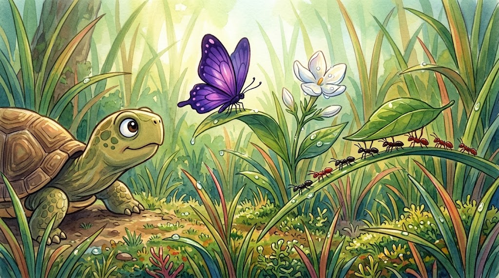

Habang naglalakad siya, nakita ni Pagong ang mga bagay na hindi napansin ng iba: ang paruparong kulay ube, ang bulaklak na kakabukas pa lang, ang mga langgam na magkakasamang nagbubuhat ng dahon.

"Ang ganda!" bulong niya. 

