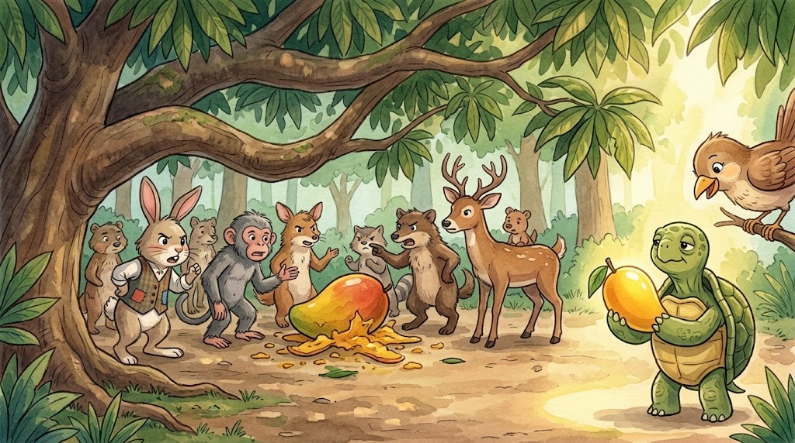

Pagdating ni Pagong sa puno ng mangga, nakaupo na ang lahat, pagod at nag-aaway kung sino ang nauna. Wala na ang pinakahinog, ibinagsak na ng hangin at nadurog.

Pero may isang mangga sa tabi ni Pagong: bigay ng nanay na ibon. 
