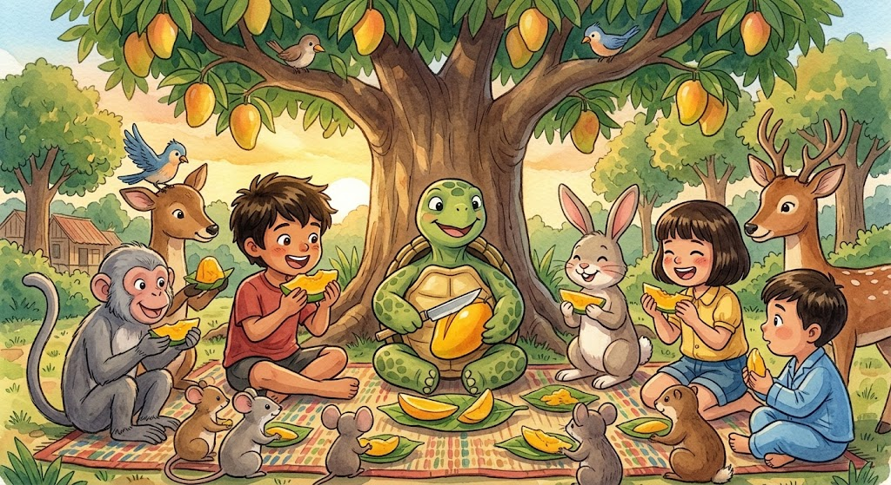

Hinati ni Pagong ang mangga sa lahat. "Mas masarap kapag sabay-sabay," sabi niya.

Mula noon, tuwing may lakad ang gubat, sinasabi nila: "Sandali, hintayin natin si Pagong. Siya ang nakakakita ng mga bagay na hindi natin napapansin." 
