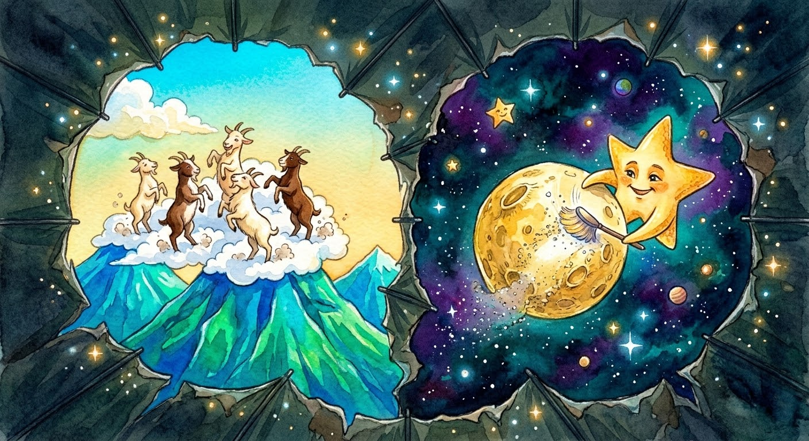

Buong hapon, naglakbay si Tala. Hindi niya namalayang tumila na ang ulan.

Pagsara niya ng payong, nakita niyang nakangiti ang tatay sa pinto. "Saan ka galing?"

"Sa dagat, bundok, at buwan, Tay!"

