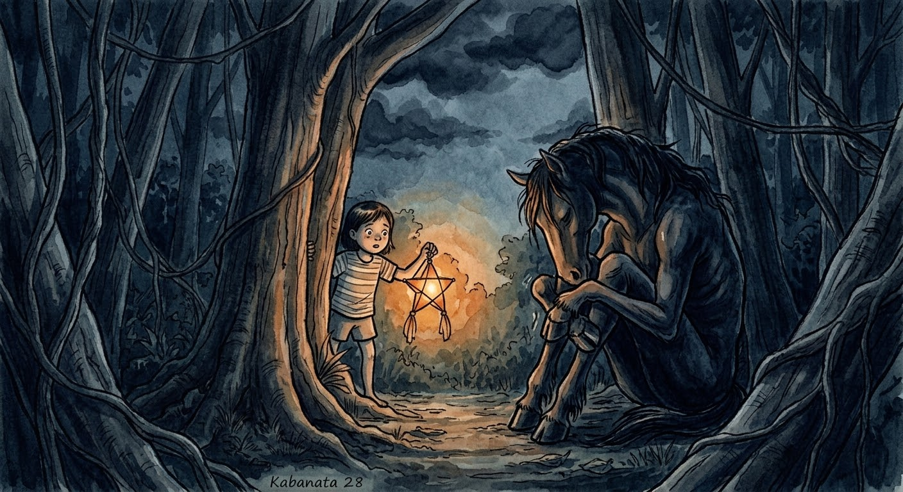

Pero isang gabi, nang humangin at namatay ang buwan, narinig ng batang si Ana ang mahinang hikbi sa likod ng puno.

Sumilip siya. Si Tikbo! Nakayuko, nanginginig, hawak ang sarili niyang mga tuhod.

