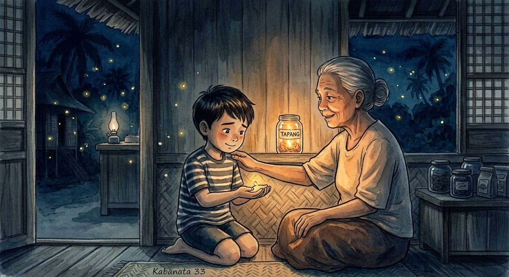

"Lola, takot pa rin po ako," bulong ni Dodong. "Okay lang 'yon, apo," sabi ni Lola. "Ang tapang ay hindi ang walang takot. Ang tapang ay ang tumuloy kahit natatakot, at hindi nahihiyang humingi ng kasama."

Ngumiti si Dodong. Isang maliit na ilaw ang kumislap sa kanyang palad.

