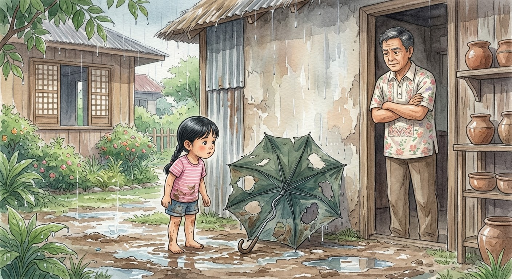

Si Tala ay batang walang magawa tuwing umuulan. Isang hapon, may nakita siya sa likod ng bahay: lumang payong, may punit, may butas, at baluktot ang isang buto.

"Sira na 'yan," sabi ng tatay niya. "Itapon mo na."
