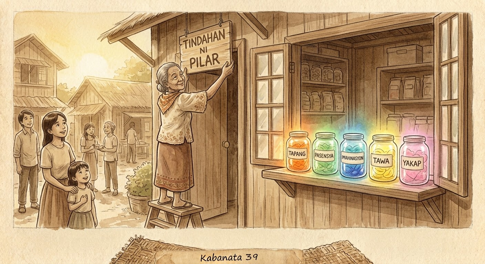

Kaya nang lumaki si Pilar, binuksan niya ang sarili niyang tindahan. Sa itaas na estante, inilagay niya ang mga garapon: Tapang. Pasensya. Imahinasyon. Tawa. Yakap.

At para kay Pilar, sila ang pinakamahahalagang paninda.
